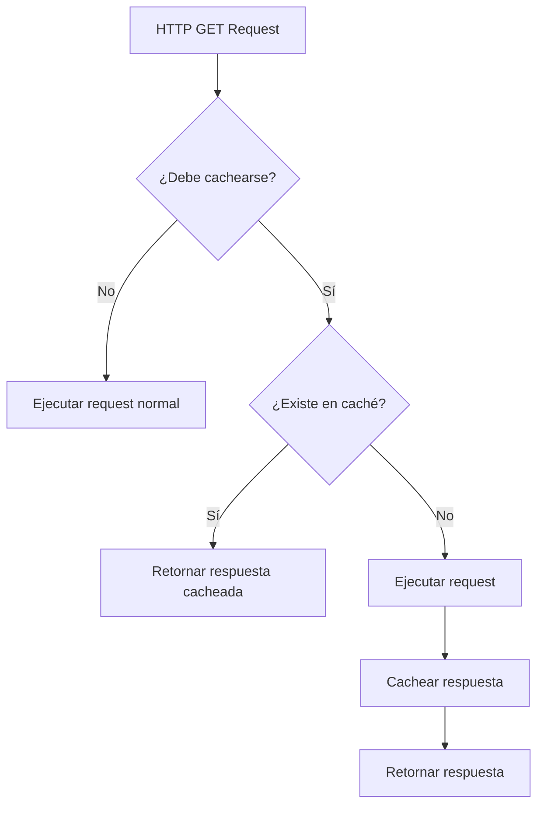
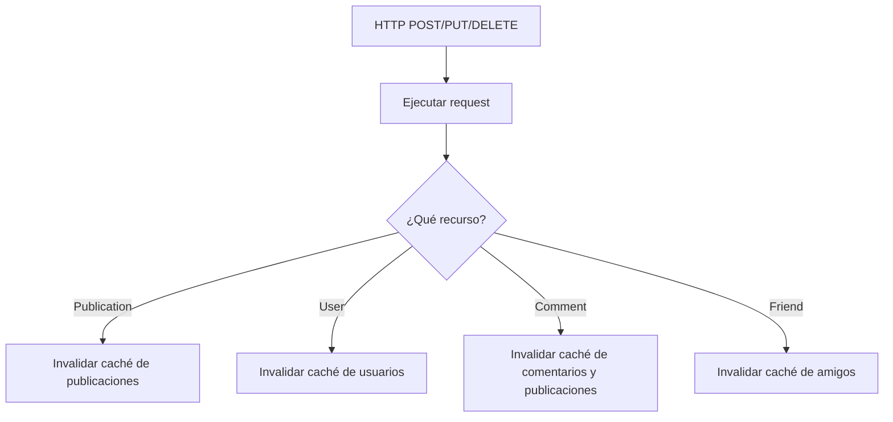

# Cache Interceptor

El **Cache Interceptor** es un interceptor HTTP que cachea automáticamente las respuestas de requests GET para mejorar el rendimiento y reducir el tráfico de red.

## Características

- ✅ **Caché automático** de requests GET
- ✅ **Configuración por endpoint** con diferentes duraciones de caché
- ✅ **Invalidación automática** en mutaciones (POST/PUT/DELETE)
- ✅ **Integración con OptimizationService** para estrategia unificada de caché
- ✅ **Respeta headers** de cache-control
- ✅ **Debug mode** para desarrollo

## Cómo Funciona

### Flujo de Caché



### Invalidación de Caché



## Configuración

### Duraciones de Caché por Endpoint

El interceptor viene preconfigurado con duraciones específicas para diferentes tipos de datos:

| Endpoint | Duración | Razón |
|----------|----------|-------|
| `/user/` | 10 minutos | Perfiles de usuario cambian poco |
| `/publication` | 3 minutos | Contenido actualizado frecuentemente |
| `/notification` | 1 minuto | Datos casi en tiempo real |
| `/message` | **No cacheado** | Datos en tiempo real |
| `/config` | 30 minutos | Configuración estática |
| `/friends` | 5 minutos | Lista de amigos relativamente estable |

### Endpoints Excluidos

Los siguientes endpoints **nunca** se cachean:

- `/auth/login`
- `/auth/logout`
- `/auth/refresh`
- `/message`
- `/websocket`
- `/socket`

### Personalizar Configuración

Para modificar la configuración de caché, edita el archivo [cache.interceptor.ts](file:///Users/carlosabarcavega/Documents/CARLOS/DUOC/socialNetworkFrontend-app/src/app/cache.interceptor.ts):

```typescript
private readonly endpointConfigs: Map<string, CacheConfig> = new Map([
  // Agregar nueva configuración
  ['/mi-endpoint', { duration: 15 * 60 * 1000 }], // 15 minutos
  
  // Deshabilitar caché para un endpoint
  ['/otro-endpoint', { enabled: false }],
]);
```

## Uso

El interceptor funciona **automáticamente** una vez registrado en `app.module.ts`. No requiere cambios en los componentes o servicios existentes.

### Ejemplo Automático

```typescript
// En cualquier servicio
export class PublicationService {
  constructor(private http: HttpClient) {}
  
  getPublications() {
    // Esta request se cacheará automáticamente por 3 minutos
    return this.http.get('/publication');
  }
  
  createPublication(data: any) {
    // Este POST invalidará el caché de publicaciones
    return this.http.post('/publication', data);
  }
}
```

### Deshabilitar Caché para Request Específico

Si necesitas deshabilitar el caché para un request específico:

```typescript
getPublications() {
  const headers = new HttpHeaders({
    'Cache-Control': 'no-cache'
  });
  
  return this.http.get('/publication', { headers });
}
```

## Integración con OptimizationService

El Cache Interceptor utiliza el `OptimizationService` existente para almacenar las respuestas cacheadas:

```typescript
// El interceptor usa estos métodos del OptimizationService:
this.optimizationService.getFromCache<T>(key);
this.optimizationService.setCache<T>(key, data);
this.optimizationService.clearCache();
```

Esto significa que:
- ✅ El caché se comparte con otras optimizaciones
- ✅ Las estadísticas de caché están centralizadas
- ✅ La limpieza de caché es consistente

## Debug y Monitoreo

### Modo Debug

En modo desarrollo, el interceptor registra operaciones de caché:

```javascript
// En la consola del navegador verás:
// [DEBUG] CacheInterceptor - Response cached
// { url: '/publication', cacheKey: 'http_cache_/publication', duration: 180000 }

// [DEBUG] CacheInterceptor - Cache invalidated for mutation
// { method: 'POST', url: '/publication' }
```

### Verificar Estadísticas de Caché

Usa el `OptimizationService` para obtener estadísticas:

```typescript
constructor(private optimizationService: OptimizationService) {}

checkCacheStats() {
  const stats = this.optimizationService.getOptimizationStats();
  console.log('Cache size:', stats.cacheSize);
  // Muestra cuántas entradas hay en caché
}
```

### Limpiar Caché Manualmente

```typescript
// Limpiar todo el caché
this.optimizationService.clearCache();
```

## Generación de Cache Keys

Las cache keys se generan basándose en:
- URL completa
- Query parameters

```typescript
// Ejemplos de cache keys:
// GET /publication?page=1
// → http_cache_/publication?page=1

// GET /user/123
// → http_cache_/user/123

// GET /publication?page=1&limit=10
// → http_cache_/publication?page=1&limit=10
```

Esto significa que diferentes parámetros generan diferentes entradas de caché.

## Estrategia de Invalidación

### Invalidación Automática

El interceptor invalida automáticamente el caché cuando detecta mutaciones:

| Mutación | Caché Invalidado |
|----------|------------------|
| POST/PUT/DELETE `/publication` | Todas las publicaciones |
| POST/PUT/DELETE `/user` | Todos los usuarios |
| POST/PUT/DELETE `/comment` | Comentarios y publicaciones relacionadas |
| POST/PUT/DELETE `/friend` | Lista de amigos |

### Invalidación Manual

Si necesitas invalidar el caché manualmente:

```typescript
// Opción 1: Limpiar todo el caché
this.optimizationService.clearCache();

// Opción 2: Usar headers no-cache en el siguiente request
const headers = new HttpHeaders({ 'Cache-Control': 'no-cache' });
this.http.get('/publication', { headers });
```

## Mejores Prácticas

### ✅ Hacer

1. **Confiar en la configuración por defecto** para la mayoría de endpoints
2. **Usar duraciones más largas** para datos estáticos (config, perfiles)
3. **Usar duraciones más cortas** para datos dinámicos (notificaciones)
4. **Deshabilitar caché** para datos en tiempo real (mensajes, WebSockets)

### ❌ Evitar

1. **No cachear** datos sensibles o que cambian constantemente
2. **No usar duraciones muy largas** para datos que cambian frecuentemente
3. **No confiar solo en el caché** para datos críticos (siempre tener fallback)

## Rendimiento

### Beneficios Esperados

- 📉 **Reducción de requests**: 30-50% menos requests de red
- ⚡ **Carga más rápida**: Respuestas instantáneas para datos cacheados
- 💾 **Menor uso de ancho de banda**: Especialmente en conexiones lentas
- 🔋 **Menor consumo de batería**: Menos actividad de red

### Consideraciones de Memoria

El caché está limitado a:
- **100 entradas máximo** en `OptimizationService`
- **Limpieza automática** de entradas expiradas
- **Estrategia LRU** (Least Recently Used) cuando se alcanza el límite

## Troubleshooting

### Problema: Los datos no se actualizan

**Solución**: El caché puede estar sirviendo datos antiguos. Opciones:

1. Esperar a que expire el caché (ver duraciones arriba)
2. Limpiar el caché manualmente: `optimizationService.clearCache()`
3. Usar `Cache-Control: no-cache` en el request

### Problema: Demasiados requests aún

**Solución**: Verificar que:

1. Los endpoints están configurados correctamente
2. No estás usando `Cache-Control: no-cache` innecesariamente
3. Los query parameters son consistentes

### Problema: Datos incorrectos después de mutación

**Solución**: La invalidación de caché puede no estar funcionando:

1. Verificar que la mutación está usando POST/PUT/DELETE
2. Verificar que el endpoint está en la lista de invalidación
3. Considerar limpiar el caché manualmente después de mutaciones críticas

## Ejemplo Completo

```typescript
import { Component, OnInit } from '@angular/core';
import { PublicationService } from '@shared/services/publication.service';
import { OptimizationService } from '@shared/services/optimization.service';

@Component({
  selector: 'app-feed',
  templateUrl: './feed.component.html'
})
export class FeedComponent implements OnInit {
  publications$ = this.publicationService.getPublications();
  
  constructor(
    private publicationService: PublicationService,
    private optimizationService: OptimizationService
  ) {}
  
  ngOnInit() {
    // Primera carga: hace request HTTP
    // Segunda carga: usa caché (si está dentro de 3 minutos)
    this.loadPublications();
  }
  
  loadPublications() {
    // El caché se maneja automáticamente
    this.publications$ = this.publicationService.getPublications();
  }
  
  createPublication(data: any) {
    this.publicationService.createPublication(data).subscribe(() => {
      // El caché se invalida automáticamente
      // El siguiente getPublications() hará un request fresco
      this.loadPublications();
    });
  }
  
  forceRefresh() {
    // Opción 1: Limpiar todo el caché
    this.optimizationService.clearCache();
    this.loadPublications();
    
    // Opción 2: Usar no-cache header (implementar en el servicio)
    // this.publicationService.getPublicationsNoCache();
  }
  
  checkCacheStats() {
    const stats = this.optimizationService.getOptimizationStats();
    console.log('Entradas en caché:', stats.cacheSize);
  }
}
```

## Relación con Otros Sistemas

### OptimizationService

El Cache Interceptor es parte del ecosistema de optimización:

- **CacheInterceptor**: Caché HTTP a nivel de interceptor
- **OptimizationService**: Caché de datos y control de concurrencia
- **CacheService**: Caché de aplicación con localStorage

Ver [cache-system.md](file:///Users/carlosabarcavega/Documents/CARLOS/DUOC/socialNetworkFrontend-app/docs/cache-system.md) para más detalles.

### Otros Interceptors

Orden de ejecución de interceptors:

1. **AuthInterceptor**: Agrega token de autenticación
2. **CacheInterceptor**: Verifica/guarda caché ← **Nuevo**
3. **TimeoutInterceptor**: Maneja timeouts y reintentos
4. **SafariIOSErrorInterceptor**: Maneja errores específicos de Safari iOS
5. **GoogleImageErrorInterceptor**: Maneja errores de imágenes de Google

## Futuras Mejoras

Posibles mejoras para considerar:

- [ ] Caché persistente (localStorage) para sobrevivir recargas
- [ ] Invalidación más granular (por ID de recurso)
- [ ] Estrategias de caché configurables (LRU, LFU, FIFO)
- [ ] Soporte para ETags y validación condicional
- [ ] Métricas de hit rate y performance
- [ ] UI para gestionar caché en modo desarrollo
